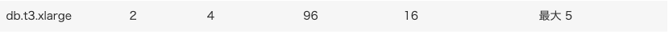
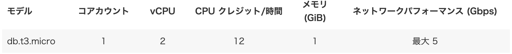

# データベースの性能比較(Docker) 

## 比較方法
High Specコンテナ、Low Specコンテナの二種類を用意し、下記テストを行った
1. 大量データの書き込み速度の比較
    1. 100万件
    2. 300万件
    3. 500万件
2. 1.ののちに+1件の書き込み速度の比較
3. indexを用いたカラムの検索速度の比較
4. indexを用いていないカラムの検索速度の比較

## 使用したデータベース
### db.t3.xlarge
**スペック**
4 vCPU, 16 GiB RAM


### db.t3.micro
**スペック**
2 vCPU, 4 GiB RAM


## テスト結果
|  | Insert | +1 Insert | SELECT (indexあり) | SELECT (Indexなし) |
| --- | --- | --- | --- | --- |
| 100万 (db.t3.xlarge) | 55.466s | 0.01s | 0.00s | 1.01s |
| 100万 (db.t3.micro) | 1m13.546s | 0.19s | 0.01s | 5.58s |
| 300万 (db.t3.xlarge) | 2m48.560s | 0.00s | 0.00s | 3.15s |
| 300万 (db.t3.micro) | 13m28.758s | 0.16s | 0.07s | 34.90s |
| 1000万 (db.t3.xlarge) | 10m16.665s | 0.00s | 0.00s | 12.77s |
| 1000万 (db.t3.micro) | - | 0.21s | 0.00s | 1 m 3.96s |

### **Insert**
- **100万件**: db.t3.microは約1.33倍遅い
- **300万件**: db.t3.microは約4.8倍遅い
- **1000万件**: db.t3.microは処理が終わらない

### **+1 Insert**
- db.t3.microは若干遅いが、実用上問題ない

### **SELECT (indexあり)**
- どちらのインスタンスもほぼ同等の高速

### **SELECT (indexなし)**
- **100万件**: db.t3.microは約5.5倍遅い
- **300万件**: db.t3.microは約11倍遅い
- **1000万件**: db.t3.microは約5倍遅い

### Indexをかけているカラムの曖昧検索に関して

#### 前方一致
```sql
mysql> EXPLAIN SELECT * FROM users where attribute_a LIKE "attr%";
+----+-------------+-------+------------+-------+----------------------+----------------------+---------+------+------+----------+-----------------------+
| id | select_type | table | partitions | type  | possible_keys        | key                  | key_len | ref  | rows | filtered | Extra                 |
+----+-------------+-------+------------+-------+----------------------+----------------------+---------+------+------+----------+-----------------------+
|  1 | SIMPLE      | users | NULL       | range | idx_users_attributes | idx_users_attributes | 43      | NULL |    8 |   100.00 | Using index condition |
+----+-------------+-------+------------+-------+----------------------+----------------------+---------+------+------+----------+-----------------------+
1 row in set, 1 warning (0.02 sec)
```

#### 後方一致
```sql
mysql> EXPLAIN SELECT * FROM users where attribute_a LIKE "%ttrA";
+----+-------------+-------+------------+------+---------------+------+---------+------+---------+----------+-------------+
| id | select_type | table | partitions | type | possible_keys | key  | key_len | ref  | rows    | filtered | Extra       |
+----+-------------+-------+------------+------+---------------+------+---------+------+---------+----------+-------------+
|  1 | SIMPLE      | users | NULL       | ALL  | NULL          | NULL | NULL    | NULL | 9139775 |    11.11 | Using where |
+----+-------------+-------+------------+------+---------------+------+---------+------+---------+----------+-------------+
1 row in set, 1 warning (0.00 sec)
```

#### 部分一致
```sql
mysql> EXPLAIN SELECT * FROM users where attribute_a LIKE "%ttr%";
+----+-------------+-------+------------+------+---------------+------+---------+------+---------+----------+-------------+
| id | select_type | table | partitions | type | possible_keys | key  | key_len | ref  | rows    | filtered | Extra       |
+----+-------------+-------+------------+------+---------------+------+---------+------+---------+----------+-------------+
|  1 | SIMPLE      | users | NULL       | ALL  | NULL          | NULL | NULL    | NULL | 9139775 |    11.11 | Using where |
+----+-------------+-------+------------+------+---------------+------+---------+------+---------+----------+-------------+
1 row in set, 1 warning (0.00 sec)
```

前方一致の場合はindexがうまく働くことがわかった、後方一致、部分一致の場合はindexは働かず、フルスキャンすることとなった ([参照](https://zenn.dev/suzuki_hoge/books/2022-12-database-index-9520da88d02c4f/viewer/4-feature))

#### 詳細ログ
##### db.t3.xlarge
<details>
<summary>100万件</summary>

**insert**    
```bash
time mysql -h test-db-docker.cbu8gwea2rp2.ap-southeast-2.rds.amazonaws.com -P 3306 -u admin -ppassword test_db < insert_1million_users.sql
mysql: [Warning] Using a password on the command line interface can be insecure.

real	0m55.466s
user	0m3.685s
sys	0m0.769s
```
    
**+1 insert**    
```bash
mysql> INSERT INTO `users` (`name`, `email`, `password`, `email_verified_at`, `attribute_a`, `attribute_b`, `attribute_c`, `attribute_d`, `attribute_e`,
    ->                      `attribute_f`, `attribute_g`, `attribute_h`, `attribute_i`, `attribute_j`, `attribute_k`, `attribute_l`, `attribute_m`,
    ->                      `attribute_n`, `attribute_o`, `attribute_p`, `attribute_q`, `attribute_r`, `attribute_s`, `attribute_t`)
    -> VALUES ('John Doe', 'john.doe@example.com', 'securepassword', NULL, 'attrA', 'attrB', 'attrC', 'attrD', 'attrE',
    ->         'attrF', 'attrG', 'attrH', 'attrI', 'attrJ', 'attrK', 'attrL', 'attrM', 'attrN', 'attrO', 'attrP',
    ->         'attrQ', 'attrR', 'attrS', 'attrT');
Query OK, 1 row affected (0.01 sec)
```
    
**SELECT**  
* indexあり  
    ```sql
    mysql> EXPLAIN SELECT * FROM users where attribute_a = "attrA";
    +----+-------------+-------+------------+------+----------------------+----------------------+---------+-------+------+----------+-------+
    | id | select_type | table | partitions | type | possible_keys        | key                  | key_len | ref   | rows | filtered | Extra |
    +----+-------------+-------+------------+------+----------------------+----------------------+---------+-------+------+----------+-------+
    |  1 | SIMPLE      | users | NULL       | ref  | idx_users_attributes | idx_users_attributes | 43      | const |    1 |   100.00 | NULL  |
    +----+-------------+-------+------------+------+----------------------+----------------------+---------+-------+------+----------+-------+
    1 row in set, 1 warning (0.01 sec)
    
    mysql> SELECT * FROM users where attribute_a = "attrA";
    +---------+----------+----------------------+----------------+-------------------+-------------+-------------+-------------+-------------+-------------+-------------+-------------+-------------+-------------+-------------+-------------+-------------+-------------+-------------+-------------+-------------+-------------+-------------+-------------+-------------+---------------------+---------------------+
    | id      | name     | email                | password       | email_verified_at | attribute_a | attribute_b | attribute_c | attribute_d | attribute_e | attribute_f | attribute_g | attribute_h | attribute_i | attribute_j | attribute_k | attribute_l | attribute_m | attribute_n | attribute_o | attribute_p | attribute_q | attribute_r | attribute_s | attribute_t | created_at          | updated_at          |
    +---------+----------+----------------------+----------------+-------------------+-------------+-------------+-------------+-------------+-------------+-------------+-------------+-------------+-------------+-------------+-------------+-------------+-------------+-------------+-------------+-------------+-------------+-------------+-------------+-------------+---------------------+---------------------+
    | 1000001 | John Doe | john.doe@example.com | securepassword | NULL              | attrA       | attrB       | attrC       | attrD       | attrE       | attrF       | attrG       | attrH       | attrI       | attrJ       | attrK       | attrL       | attrM       | attrN       | attrO       | attrP       | attrQ       | attrR       | attrS       | attrT       | 2024-06-30 05:44:36 | 2024-06-30 05:44:36 |
    +---------+----------+----------------------+----------------+-------------------+-------------+-------------+-------------+-------------+-------------+-------------+-------------+-------------+-------------+-------------+-------------+-------------+-------------+-------------+-------------+-------------+-------------+-------------+-------------+-------------+---------------------+---------------------+
    1 row in set (0.00 sec)
    ```
    
* indexなし  
    ```sql
    mysql> EXPLAIN SELECT * FROM users where name = "John Doe";
    +----+-------------+-------+------------+------+---------------+------+---------+------+--------+----------+-------------+
    | id | select_type | table | partitions | type | possible_keys | key  | key_len | ref  | rows   | filtered | Extra       |
    +----+-------------+-------+------------+------+---------------+------+---------+------+--------+----------+-------------+
    |  1 | SIMPLE      | users | NULL       | ALL  | NULL          | NULL | NULL    | NULL | 981791 |    10.00 | Using where |
    +----+-------------+-------+------------+------+---------------+------+---------+------+--------+----------+-------------+
    1 row in set, 1 warning (0.00 sec)
    
    mysql> SELECT * FROM users where name = "John Doe";
    +---------+----------+----------------------+----------------+-------------------+-------------+-------------+-------------+-------------+-------------+-------------+-------------+-------------+-------------+-------------+-------------+-------------+-------------+-------------+-------------+-------------+-------------+-------------+-------------+-------------+---------------------+---------------------+
    | id      | name     | email                | password       | email_verified_at | attribute_a | attribute_b | attribute_c | attribute_d | attribute_e | attribute_f | attribute_g | attribute_h | attribute_i | attribute_j | attribute_k | attribute_l | attribute_m | attribute_n | attribute_o | attribute_p | attribute_q | attribute_r | attribute_s | attribute_t | created_at          | updated_at          |
    +---------+----------+----------------------+----------------+-------------------+-------------+-------------+-------------+-------------+-------------+-------------+-------------+-------------+-------------+-------------+-------------+-------------+-------------+-------------+-------------+-------------+-------------+-------------+-------------+-------------+---------------------+---------------------+
    | 1000001 | John Doe | john.doe@example.com | securepassword | NULL              | attrA       | attrB       | attrC       | attrD       | attrE       | attrF       | attrG       | attrH       | attrI       | attrJ       | attrK       | attrL       | attrM       | attrN       | attrO       | attrP       | attrQ       | attrR       | attrS       | attrT       | 2024-06-30 05:44:36 | 2024-06-30 05:44:36 |
    +---------+----------+----------------------+----------------+-------------------+-------------+-------------+-------------+-------------+-------------+-------------+-------------+-------------+-------------+-------------+-------------+-------------+-------------+-------------+-------------+-------------+-------------+-------------+-------------+-------------+---------------------+---------------------+
    1 row in set (1.01 sec)
    ```
</details>
<details>
<summary>300万件</summary>

**insert**    
```bash
time mysql -h test-db-docker.cbu8gwea2rp2.ap-southeast-2.rds.amazonaws.com -P 3306 -u admin -ppassword test_db < insert_3million_users.sql
mysql: [Warning] Using a password on the command line interface can be insecure.

real	2m48.560s
user	0m10.852s
sys	0m2.031s
```
    
**+1 insert**    
```bash
mysql> INSERT INTO `users` (`name`, `email`, `password`, `email_verified_at`, `attribute_a`, `attribute_b`, `attribute_c`, `attribute_d`, `attribute_e`,
    ->                      `attribute_f`, `attribute_g`, `attribute_h`, `attribute_i`, `attribute_j`, `attribute_k`, `attribute_l`, `attribute_m`,
    ->                      `attribute_n`, `attribute_o`, `attribute_p`, `attribute_q`, `attribute_r`, `attribute_s`, `attribute_t`)
    -> VALUES ('John Doe', 'john.doe@example.com', 'securepassword', NULL, 'attrA', 'attrB', 'attrC', 'attrD', 'attrE',
    ->         'attrF', 'attrG', 'attrH', 'attrI', 'attrJ', 'attrK', 'attrL', 'attrM', 'attrN', 'attrO', 'attrP',
    ->         'attrQ', 'attrR', 'attrS', 'attrT');
Query OK, 1 row affected (0.00 sec)
```
    
**SELECT**
    
* indexあり  
    ```sql
    mysql> EXPLAIN SELECT * FROM users where attribute_a = "attrA";
    +----+-------------+-------+------------+------+----------------------+----------------------+---------+-------+------+----------+-------+
    | id | select_type | table | partitions | type | possible_keys        | key                  | key_len | ref   | rows | filtered | Extra |
    +----+-------------+-------+------------+------+----------------------+----------------------+---------+-------+------+----------+-------+
    |  1 | SIMPLE      | users | NULL       | ref  | idx_users_attributes | idx_users_attributes | 43      | const |    1 |   100.00 | NULL  |
    +----+-------------+-------+------------+------+----------------------+----------------------+---------+-------+------+----------+-------+
    1 row in set, 1 warning (0.00 sec)
    
    mysql> SELECT * FROM users where attribute_a = "attrA";
    +---------+----------+----------------------+----------------+-------------------+-------------+-------------+-------------+-------------+-------------+-------------+-------------+-------------+-------------+-------------+-------------+-------------+-------------+-------------+-------------+-------------+-------------+-------------+-------------+-------------+---------------------+---------------------+
    | id      | name     | email                | password       | email_verified_at | attribute_a | attribute_b | attribute_c | attribute_d | attribute_e | attribute_f | attribute_g | attribute_h | attribute_i | attribute_j | attribute_k | attribute_l | attribute_m | attribute_n | attribute_o | attribute_p | attribute_q | attribute_r | attribute_s | attribute_t | created_at          | updated_at          |
    +---------+----------+----------------------+----------------+-------------------+-------------+-------------+-------------+-------------+-------------+-------------+-------------+-------------+-------------+-------------+-------------+-------------+-------------+-------------+-------------+-------------+-------------+-------------+-------------+-------------+---------------------+---------------------+
    | 3000001 | John Doe | john.doe@example.com | securepassword | NULL              | attrA       | attrB       | attrC       | attrD       | attrE       | attrF       | attrG       | attrH       | attrI       | attrJ       | attrK       | attrL       | attrM       | attrN       | attrO       | attrP       | attrQ       | attrR       | attrS       | attrT       | 2024-06-30 05:48:54 | 2024-06-30 05:48:54 |
    +---------+----------+----------------------+----------------+-------------------+-------------+-------------+-------------+-------------+-------------+-------------+-------------+-------------+-------------+-------------+-------------+-------------+-------------+-------------+-------------+-------------+-------------+-------------+-------------+-------------+---------------------+---------------------+
    1 row in set (0.00 sec)
    ```
    
* indexなし  
    ```sql
    mysql> EXPLAIN SELECT * FROM users where name = "John Doe";
    +----+-------------+-------+------------+------+---------------+------+---------+------+---------+----------+-------------+
    | id | select_type | table | partitions | type | possible_keys | key  | key_len | ref  | rows    | filtered | Extra       |
    +----+-------------+-------+------------+------+---------------+------+---------+------+---------+----------+-------------+
    |  1 | SIMPLE      | users | NULL       | ALL  | NULL          | NULL | NULL    | NULL | 2874683 |    10.00 | Using where |
    +----+-------------+-------+------------+------+---------------+------+---------+------+---------+----------+-------------+
    1 row in set, 1 warning (0.00 sec)
    
    mysql> SELECT * FROM users where name = "John Doe";
    +---------+----------+----------------------+----------------+-------------------+-------------+-------------+-------------+-------------+-------------+-------------+-------------+-------------+-------------+-------------+-------------+-------------+-------------+-------------+-------------+-------------+-------------+-------------+-------------+-------------+---------------------+---------------------+
    | id      | name     | email                | password       | email_verified_at | attribute_a | attribute_b | attribute_c | attribute_d | attribute_e | attribute_f | attribute_g | attribute_h | attribute_i | attribute_j | attribute_k | attribute_l | attribute_m | attribute_n | attribute_o | attribute_p | attribute_q | attribute_r | attribute_s | attribute_t | created_at          | updated_at          |
    +---------+----------+----------------------+----------------+-------------------+-------------+-------------+-------------+-------------+-------------+-------------+-------------+-------------+-------------+-------------+-------------+-------------+-------------+-------------+-------------+-------------+-------------+-------------+-------------+-------------+---------------------+---------------------+
    | 3000001 | John Doe | john.doe@example.com | securepassword | NULL              | attrA       | attrB       | attrC       | attrD       | attrE       | attrF       | attrG       | attrH       | attrI       | attrJ       | attrK       | attrL       | attrM       | attrN       | attrO       | attrP       | attrQ       | attrR       | attrS       | attrT       | 2024-06-30 05:48:54 | 2024-06-30 05:48:54 |
    +---------+----------+----------------------+----------------+-------------------+-------------+-------------+-------------+-------------+-------------+-------------+-------------+-------------+-------------+-------------+-------------+-------------+-------------+-------------+-------------+-------------+-------------+-------------+-------------+-------------+---------------------+---------------------+
    1 row in set (3.15 sec)
    ```
</details>
<details>
<summary>1000万件</summary>

**insert**    
```bash
time mysql -h test-db-docker.cbu8gwea2rp2.ap-southeast-2.rds.amazonaws.com -P 3306 -u admin -ppassword test_db < insert_10million_users.sql
mysql: [Warning] Using a password on the command line interface can be insecure.

real	10m16.665s
user	0m35.327s
sys	0m7.929s
```
    
**+1 insert**
```bash
mysql> INSERT INTO `users` (`name`, `email`, `password`, `email_verified_at`, `attribute_a`, `attribute_b`, `attribute_c`, `attribute_d`, `attribute_e`,
    ->                      `attribute_f`, `attribute_g`, `attribute_h`, `attribute_i`, `attribute_j`, `attribute_k`, `attribute_l`, `attribute_m`,
    ->                      `attribute_n`, `attribute_o`, `attribute_p`, `attribute_q`, `attribute_r`, `attribute_s`, `attribute_t`)
    -> VALUES ('John Doe', 'john.doe@example.com', 'securepassword', NULL, 'attrA', 'attrB', 'attrC', 'attrD', 'attrE',
    ->         'attrF', 'attrG', 'attrH', 'attrI', 'attrJ', 'attrK', 'attrL', 'attrM', 'attrN', 'attrO', 'attrP',
    ->         'attrQ', 'attrR', 'attrS', 'attrT');
Query OK, 1 row affected (0.00 sec)
```
    
**SELECT**    
* indexあり
    ```sql
    mysql> EXPLAIN SELECT * FROM users where attribute_a = "attrA";
    +----+-------------+-------+------------+------+----------------------+----------------------+---------+-------+------+----------+-------+
    | id | select_type | table | partitions | type | possible_keys        | key                  | key_len | ref   | rows | filtered | Extra |
    +----+-------------+-------+------------+------+----------------------+----------------------+---------+-------+------+----------+-------+
    |  1 | SIMPLE      | users | NULL       | ref  | idx_users_attributes | idx_users_attributes | 43      | const |    1 |   100.00 | NULL  |
    +----+-------------+-------+------------+------+----------------------+----------------------+---------+-------+------+----------+-------+
    1 row in set, 1 warning (0.00 sec)
    
    mysql> SELECT * FROM users where attribute_a = "attrA";
    +----------+----------+----------------------+----------------+-------------------+-------------+-------------+-------------+-------------+-------------+-------------+-------------+-------------+-------------+-------------+-------------+-------------+-------------+-------------+-------------+-------------+-------------+-------------+-------------+-------------+---------------------+---------------------+
    | id       | name     | email                | password       | email_verified_at | attribute_a | attribute_b | attribute_c | attribute_d | attribute_e | attribute_f | attribute_g | attribute_h | attribute_i | attribute_j | attribute_k | attribute_l | attribute_m | attribute_n | attribute_o | attribute_p | attribute_q | attribute_r | attribute_s | attribute_t | created_at          | updated_at          |
    +----------+----------+----------------------+----------------+-------------------+-------------+-------------+-------------+-------------+-------------+-------------+-------------+-------------+-------------+-------------+-------------+-------------+-------------+-------------+-------------+-------------+-------------+-------------+-------------+-------------+---------------------+---------------------+
    | 10000001 | John Doe | john.doe@example.com | securepassword | NULL              | attrA       | attrB       | attrC       | attrD       | attrE       | attrF       | attrG       | attrH       | attrI       | attrJ       | attrK       | attrL       | attrM       | attrN       | attrO       | attrP       | attrQ       | attrR       | attrS       | attrT       | 2024-06-30 06:01:17 | 2024-06-30 06:01:17 |
    +----------+----------+----------------------+----------------+-------------------+-------------+-------------+-------------+-------------+-------------+-------------+-------------+-------------+-------------+-------------+-------------+-------------+-------------+-------------+-------------+-------------+-------------+-------------+-------------+-------------+---------------------+---------------------+
    1 row in set (0.00 sec)
    ```
    
* indexなし
    ```sql
    mysql> EXPLAIN SELECT * FROM users where name = "John Doe";
    +----+-------------+-------+------------+------+---------------+------+---------+------+---------+----------+-------------+
    | id | select_type | table | partitions | type | possible_keys | key  | key_len | ref  | rows    | filtered | Extra       |
    +----+-------------+-------+------------+------+---------------+------+---------+------+---------+----------+-------------+
    |  1 | SIMPLE      | users | NULL       | ALL  | NULL          | NULL | NULL    | NULL | 9810484 |    10.00 | Using where |
    +----+-------------+-------+------------+------+---------------+------+---------+------+---------+----------+-------------+
    1 row in set, 1 warning (0.00 sec)
    
    mysql> SELECT * FROM users where name = "John Doe";
    +----------+----------+----------------------+----------------+-------------------+-------------+-------------+-------------+-------------+-------------+-------------+-------------+-------------+-------------+-------------+-------------+-------------+-------------+-------------+-------------+-------------+-------------+-------------+-------------+-------------+---------------------+---------------------+
    | id       | name     | email                | password       | email_verified_at | attribute_a | attribute_b | attribute_c | attribute_d | attribute_e | attribute_f | attribute_g | attribute_h | attribute_i | attribute_j | attribute_k | attribute_l | attribute_m | attribute_n | attribute_o | attribute_p | attribute_q | attribute_r | attribute_s | attribute_t | created_at          | updated_at          |
    +----------+----------+----------------------+----------------+-------------------+-------------+-------------+-------------+-------------+-------------+-------------+-------------+-------------+-------------+-------------+-------------+-------------+-------------+-------------+-------------+-------------+-------------+-------------+-------------+-------------+---------------------+---------------------+
    | 10000001 | John Doe | john.doe@example.com | securepassword | NULL              | attrA       | attrB       | attrC       | attrD       | attrE       | attrF       | attrG       | attrH       | attrI       | attrJ       | attrK       | attrL       | attrM       | attrN       | attrO       | attrP       | attrQ       | attrR       | attrS       | attrT       | 2024-06-30 06:01:17 | 2024-06-30 06:01:17 |
    +----------+----------+----------------------+----------------+-------------------+-------------+-------------+-------------+-------------+-------------+-------------+-------------+-------------+-------------+-------------+-------------+-------------+-------------+-------------+-------------+-------------+-------------+-------------+-------------+-------------+---------------------+---------------------+
    1 row in set (12.77 sec)
    ```
</details>

##### db.t3.small
<details>
<summary>100万件</summary>

**insert**    
```bash
time mysql -h test-db-docker.cbu8gwea2rp2.ap-southeast-2.rds.amazonaws.com -P 3306 -u admin -ppassword test_db < insert_1million_users.sql
mysql: [Warning] Using a password on the command line interface can be insecure.

real	1m13.546s
user	0m3.819s
sys	0m1.022s
```
    
**+1 insert**    
```bash
mysql> INSERT INTO `users` (`name`, `email`, `password`, `email_verified_at`, `attribute_a`, `attribute_b`, `attribute_c`, `attribute_d`, `attribute_e`,
->                      `attribute_f`, `attribute_g`, `attribute_h`, `attribute_i`, `attribute_j`, `attribute_k`, `attribute_l`, `attribute_m`,
->                      `attribute_n`, `attribute_o`, `attribute_p`, `attribute_q`, `attribute_r`, `attribute_s`, `attribute_t`)
-> VALUES ('John Doe', 'john.doe@example.com', 'securepassword', NULL, 'attrA', 'attrB', 'attrC', 'attrD', 'attrE',
->         'attrF', 'attrG', 'attrH', 'attrI', 'attrJ', 'attrK', 'attrL', 'attrM', 'attrN', 'attrO', 'attrP',
->         'attrQ', 'attrR', 'attrS', 'attrT');
Query OK, 1 row affected (0.19 sec)
```
    
**SELECT**
    
* indexあり  
    ```sql
    mysql> EXPLAIN SELECT * FROM users where attribute_a = "attrA";
    +----+-------------+-------+------------+------+----------------------+----------------------+---------+-------+------+----------+-------+
    | id | select_type | table | partitions | type | possible_keys        | key                  | key_len | ref   | rows | filtered | Extra |
    +----+-------------+-------+------------+------+----------------------+----------------------+---------+-------+------+----------+-------+
    |  1 | SIMPLE      | users | NULL       | ref  | idx_users_attributes | idx_users_attributes | 43      | const |    1 |   100.00 | NULL  |
    +----+-------------+-------+------------+------+----------------------+----------------------+---------+-------+------+----------+-------+
    1 row in set, 1 warning (0.01 sec)
    
    mysql> SELECT * FROM users where attribute_a = "attrA";
    +---------+----------+----------------------+----------------+-------------------+-------------+-------------+-------------+-------------+-------------+-------------+-------------+-------------+-------------+-------------+-------------+-------------+-------------+-------------+-------------+-------------+-------------+-------------+-------------+-------------+---------------------+---------------------+
    | id      | name     | email                | password       | email_verified_at | attribute_a | attribute_b | attribute_c | attribute_d | attribute_e | attribute_f | attribute_g | attribute_h | attribute_i | attribute_j | attribute_k | attribute_l | attribute_m | attribute_n | attribute_o | attribute_p | attribute_q | attribute_r | attribute_s | attribute_t | created_at          | updated_at          |
    +---------+----------+----------------------+----------------+-------------------+-------------+-------------+-------------+-------------+-------------+-------------+-------------+-------------+-------------+-------------+-------------+-------------+-------------+-------------+-------------+-------------+-------------+-------------+-------------+-------------+---------------------+---------------------+
    | 1000001 | John Doe | john.doe@example.com | securepassword | NULL              | attrA       | attrB       | attrC       | attrD       | attrE       | attrF       | attrG       | attrH       | attrI       | attrJ       | attrK       | attrL       | attrM       | attrN       | attrO       | attrP       | attrQ       | attrR       | attrS       | attrT       | 2024-06-30 04:48:00 | 2024-06-30 04:48:00 |
    +---------+----------+----------------------+----------------+-------------------+-------------+-------------+-------------+-------------+-------------+-------------+-------------+-------------+-------------+-------------+-------------+-------------+-------------+-------------+-------------+-------------+-------------+-------------+-------------+-------------+---------------------+---------------------+
    1 row in set (0.01 sec)
    ```
    
* indexなし
    ```sql
    mysql> EXPLAIN SELECT * FROM users where name = "John Doe";
    +----+-------------+-------+------------+------+---------------+------+---------+------+--------+----------+-------------+
    | id | select_type | table | partitions | type | possible_keys | key  | key_len | ref  | rows   | filtered | Extra       |
    +----+-------------+-------+------------+------+---------------+------+---------+------+--------+----------+-------------+
    |  1 | SIMPLE      | users | NULL       | ALL  | NULL          | NULL | NULL    | NULL | 955783 |    10.00 | Using where |
    +----+-------------+-------+------------+------+---------------+------+---------+------+--------+----------+-------------+
    1 row in set, 1 warning (0.00 sec)
    
    mysql> SELECT * FROM users where name = "John Doe";
    +---------+----------+----------------------+----------------+-------------------+-------------+-------------+-------------+-------------+-------------+-------------+-------------+-------------+-------------+-------------+-------------+-------------+-------------+-------------+-------------+-------------+-------------+-------------+-------------+-------------+---------------------+---------------------+
    | id      | name     | email                | password       | email_verified_at | attribute_a | attribute_b | attribute_c | attribute_d | attribute_e | attribute_f | attribute_g | attribute_h | attribute_i | attribute_j | attribute_k | attribute_l | attribute_m | attribute_n | attribute_o | attribute_p | attribute_q | attribute_r | attribute_s | attribute_t | created_at          | updated_at          |
    +---------+----------+----------------------+----------------+-------------------+-------------+-------------+-------------+-------------+-------------+-------------+-------------+-------------+-------------+-------------+-------------+-------------+-------------+-------------+-------------+-------------+-------------+-------------+-------------+-------------+---------------------+---------------------+
    | 1000001 | John Doe | john.doe@example.com | securepassword | NULL              | attrA       | attrB       | attrC       | attrD       | attrE       | attrF       | attrG       | attrH       | attrI       | attrJ       | attrK       | attrL       | attrM       | attrN       | attrO       | attrP       | attrQ       | attrR       | attrS       | attrT       | 2024-06-30 04:48:00 | 2024-06-30 04:48:00 |
    +---------+----------+----------------------+----------------+-------------------+-------------+-------------+-------------+-------------+-------------+-------------+-------------+-------------+-------------+-------------+-------------+-------------+-------------+-------------+-------------+-------------+-------------+-------------+-------------+-------------+---------------------+---------------------+
    1 row in set (5.58 sec)
    ```
</details>
<details>
<summary>300万件</summary>

**insert**    
```bash
time mysql -h test-db-docker.cbu8gwea2rp2.ap-southeast-2.rds.amazonaws.com -P 3306 -u admin -ppassword test_db < insert_3million_users.sql
mysql: [Warning] Using a password on the command line interface can be insecure.

real	13m28.758s
user	0m10.232s
sys	0m1.993s
```
    
**+1 insert**    
```bash
mysql> INSERT INTO `users` (`name`, `email`, `password`, `email_verified_at`, `attribute_a`, `attribute_b`, `attribute_c`, `attribute_d`, `attribute_e`,
    ->                      `attribute_f`, `attribute_g`, `attribute_h`, `attribute_i`, `attribute_j`, `attribute_k`, `attribute_l`, `attribute_m`,
    ->                      `attribute_n`, `attribute_o`, `attribute_p`, `attribute_q`, `attribute_r`, `attribute_s`, `attribute_t`)
    -> VALUES ('John Doe', 'john.doe@example.com', 'securepassword', NULL, 'attrA', 'attrB', 'attrC', 'attrD', 'attrE',
    ->         'attrF', 'attrG', 'attrH', 'attrI', 'attrJ', 'attrK', 'attrL', 'attrM', 'attrN', 'attrO', 'attrP',
    ->         'attrQ', 'attrR', 'attrS', 'attrT');
Query OK, 1 row affected (0.16 sec)
```
    
**SELECT**  
* indexあり  
    ```sql
    mysql> EXPLAIN SELECT * FROM users where attribute_a = "attrA";
    +----+-------------+-------+------------+------+----------------------+----------------------+---------+-------+------+----------+-------+
    | id | select_type | table | partitions | type | possible_keys        | key                  | key_len | ref   | rows | filtered | Extra |
    +----+-------------+-------+------------+------+----------------------+----------------------+---------+-------+------+----------+-------+
    |  1 | SIMPLE      | users | NULL       | ref  | idx_users_attributes | idx_users_attributes | 43      | const |    1 |   100.00 | NULL  |
    +----+-------------+-------+------------+------+----------------------+----------------------+---------+-------+------+----------+-------+
    1 row in set, 1 warning (0.03 sec)
    
    mysql> SELECT * FROM users where attribute_a = "attrA";
    +---------+----------+----------------------+----------------+-------------------+-------------+-------------+-------------+-------------+-------------+-------------+-------------+-------------+-------------+-------------+-------------+-------------+-------------+-------------+-------------+-------------+-------------+-------------+-------------+-------------+---------------------+---------------------+
    | id      | name     | email                | password       | email_verified_at | attribute_a | attribute_b | attribute_c | attribute_d | attribute_e | attribute_f | attribute_g | attribute_h | attribute_i | attribute_j | attribute_k | attribute_l | attribute_m | attribute_n | attribute_o | attribute_p | attribute_q | attribute_r | attribute_s | attribute_t | created_at          | updated_at          |
    +---------+----------+----------------------+----------------+-------------------+-------------+-------------+-------------+-------------+-------------+-------------+-------------+-------------+-------------+-------------+-------------+-------------+-------------+-------------+-------------+-------------+-------------+-------------+-------------+-------------+---------------------+---------------------+
    | 3000001 | John Doe | john.doe@example.com | securepassword | NULL              | attrA       | attrB       | attrC       | attrD       | attrE       | attrF       | attrG       | attrH       | attrI       | attrJ       | attrK       | attrL       | attrM       | attrN       | attrO       | attrP       | attrQ       | attrR       | attrS       | attrT       | 2024-06-30 05:19:43 | 2024-06-30 05:19:43 |
    +---------+----------+----------------------+----------------+-------------------+-------------+-------------+-------------+-------------+-------------+-------------+-------------+-------------+-------------+-------------+-------------+-------------+-------------+-------------+-------------+-------------+-------------+-------------+-------------+-------------+---------------------+---------------------+
    1 row in set (0.07 sec)
    ```
    
* indexなし  
    ```sql
    mysql> EXPLAIN SELECT * FROM users where name = "John Doe";
    +----+-------------+-------+------------+------+---------------+------+---------+------+---------+----------+-------------+
    | id | select_type | table | partitions | type | possible_keys | key  | key_len | ref  | rows    | filtered | Extra       |
    +----+-------------+-------+------------+------+---------------+------+---------+------+---------+----------+-------------+
    |  1 | SIMPLE      | users | NULL       | ALL  | NULL          | NULL | NULL    | NULL | 2947176 |    10.00 | Using where |
    +----+-------------+-------+------------+------+---------------+------+---------+------+---------+----------+-------------+
    1 row in set, 1 warning (0.00 sec)
    
    mysql> SELECT * FROM users where name = "John Doe";
    +---------+----------+----------------------+----------------+-------------------+-------------+-------------+-------------+-------------+-------------+-------------+-------------+-------------+-------------+-------------+-------------+-------------+-------------+-------------+-------------+-------------+-------------+-------------+-------------+-------------+---------------------+---------------------+
    | id      | name     | email                | password       | email_verified_at | attribute_a | attribute_b | attribute_c | attribute_d | attribute_e | attribute_f | attribute_g | attribute_h | attribute_i | attribute_j | attribute_k | attribute_l | attribute_m | attribute_n | attribute_o | attribute_p | attribute_q | attribute_r | attribute_s | attribute_t | created_at          | updated_at          |
    +---------+----------+----------------------+----------------+-------------------+-------------+-------------+-------------+-------------+-------------+-------------+-------------+-------------+-------------+-------------+-------------+-------------+-------------+-------------+-------------+-------------+-------------+-------------+-------------+-------------+---------------------+---------------------+
    | 3000001 | John Doe | john.doe@example.com | securepassword | NULL              | attrA       | attrB       | attrC       | attrD       | attrE       | attrF       | attrG       | attrH       | attrI       | attrJ       | attrK       | attrL       | attrM       | attrN       | attrO       | attrP       | attrQ       | attrR       | attrS       | attrT       | 2024-06-30 05:19:43 | 2024-06-30 05:19:43 |
    +---------+----------+----------------------+----------------+-------------------+-------------+-------------+-------------+-------------+-------------+-------------+-------------+-------------+-------------+-------------+-------------+-------------+-------------+-------------+-------------+-------------+-------------+-------------+-------------+-------------+---------------------+---------------------+
    1 row in set (34.90 sec)
    ```
</details>
<details>
<summary>1000万件</summary>

**insert**    
```bash
処理が終わらないので、db.t3.largeの方でデータを入れたのを使う
```
    
**+1 insert**    
```bash
mysql> INSERT INTO `users` (`name`, `email`, `password`, `email_verified_at`, `attribute_a`, `attribute_b`, `attribute_c`, `attribute_d`, `attribute_e`,
    ->                      `attribute_f`, `attribute_g`, `attribute_h`, `attribute_i`, `attribute_j`, `attribute_k`, `attribute_l`, `attribute_m`,
    ->                      `attribute_n`, `attribute_o`, `attribute_p`, `attribute_q`, `attribute_r`, `attribute_s`, `attribute_t`)
    -> VALUES ('John Doe', 'john.doe@example.com', 'securepassword', NULL, 'attrA', 'attrB', 'attrC', 'attrD', 'attrE',
    ->         'attrF', 'attrG', 'attrH', 'attrI', 'attrJ', 'attrK', 'attrL', 'attrM', 'attrN', 'attrO', 'attrP',
    ->         'attrQ', 'attrR', 'attrS', 'attrT');
Query OK, 1 row affected (0.21 sec)
```
    
**SELECT** 
* indexあり
    ```sql
    mysql> EXPLAIN SELECT * FROM users where attribute_a = "attrA";
    +----+-------------+-------+------------+------+----------------------+----------------------+---------+-------+------+----------+-------+
    | id | select_type | table | partitions | type | possible_keys        | key                  | key_len | ref   | rows | filtered | Extra |
    +----+-------------+-------+------------+------+----------------------+----------------------+---------+-------+------+----------+-------+
    |  1 | SIMPLE      | users | NULL       | ref  | idx_users_attributes | idx_users_attributes | 43      | const |    1 |   100.00 | NULL  |
    +----+-------------+-------+------------+------+----------------------+----------------------+---------+-------+------+----------+-------+
    1 row in set, 1 warning (0.01 sec)
    
    mysql> SELECT * FROM users where attribute_a = "attrA";
    +----------+----------+----------------------+----------------+-------------------+-------------+-------------+-------------+-------------+-------------+-------------+-------------+-------------+-------------+-------------+-------------+-------------+-------------+-------------+-------------+-------------+-------------+-------------+-------------+-------------+---------------------+---------------------+
    | id       | name     | email                | password       | email_verified_at | attribute_a | attribute_b | attribute_c | attribute_d | attribute_e | attribute_f | attribute_g | attribute_h | attribute_i | attribute_j | attribute_k | attribute_l | attribute_m | attribute_n | attribute_o | attribute_p | attribute_q | attribute_r | attribute_s | attribute_t | created_at          | updated_at          |
    +----------+----------+----------------------+----------------+-------------------+-------------+-------------+-------------+-------------+-------------+-------------+-------------+-------------+-------------+-------------+-------------+-------------+-------------+-------------+-------------+-------------+-------------+-------------+-------------+-------------+---------------------+---------------------+
    | 10000004 | John Doe | john.doe@example.com | securepassword | NULL              | attrA       | attrB       | attrC       | attrD       | attrE       | attrF       | attrG       | attrH       | attrI       | attrJ       | attrK       | attrL       | attrM       | attrN       | attrO       | attrP       | attrQ       | attrR       | attrS       | attrT       | 2024-06-30 06:19:05 | 2024-06-30 06:19:05 |
    +----------+----------+----------------------+----------------+-------------------+-------------+-------------+-------------+-------------+-------------+-------------+-------------+-------------+-------------+-------------+-------------+-------------+-------------+-------------+-------------+-------------+-------------+-------------+-------------+-------------+---------------------+---------------------+
    1 row in set (0.00 sec)
    ```
    
* indexなし  
    ```sql
    mysql> EXPLAIN SELECT * FROM users where name = "John Doe";
    +----+-------------+-------+------------+------+---------------+------+---------+------+---------+----------+-------------+
    | id | select_type | table | partitions | type | possible_keys | key  | key_len | ref  | rows    | filtered | Extra       |
    +----+-------------+-------+------------+------+---------------+------+---------+------+---------+----------+-------------+
    |  1 | SIMPLE      | users | NULL       | ALL  | NULL          | NULL | NULL    | NULL | 9139775 |    10.00 | Using where |
    +----+-------------+-------+------------+------+---------------+------+---------+------+---------+----------+-------------+
    1 row in set, 1 warning (0.00 sec)
    
    mysql> SELECT * FROM users where name = "John Doe";
    +----------+----------+----------------------+----------------+-------------------+-------------+-------------+-------------+-------------+-------------+-------------+-------------+-------------+-------------+-------------+-------------+-------------+-------------+-------------+-------------+-------------+-------------+-------------+-------------+-------------+---------------------+---------------------+
    | id       | name     | email                | password       | email_verified_at | attribute_a | attribute_b | attribute_c | attribute_d | attribute_e | attribute_f | attribute_g | attribute_h | attribute_i | attribute_j | attribute_k | attribute_l | attribute_m | attribute_n | attribute_o | attribute_p | attribute_q | attribute_r | attribute_s | attribute_t | created_at          | updated_at          |
    +----------+----------+----------------------+----------------+-------------------+-------------+-------------+-------------+-------------+-------------+-------------+-------------+-------------+-------------+-------------+-------------+-------------+-------------+-------------+-------------+-------------+-------------+-------------+-------------+-------------+---------------------+---------------------+
    | 10000004 | John Doe | john.doe@example.com | securepassword | NULL              | attrA       | attrB       | attrC       | attrD       | attrE       | attrF       | attrG       | attrH       | attrI       | attrJ       | attrK       | attrL       | attrM       | attrN       | attrO       | attrP       | attrQ       | attrR       | attrS       | attrT       | 2024-06-30 06:19:05 | 2024-06-30 06:19:05 |
    +----------+----------+----------------------+----------------+-------------------+-------------+-------------+-------------+-------------+-------------+-------------+-------------+-------------+-------------+-------------+-------------+-------------+-------------+-------------+-------------+-------------+-------------+-------------+-------------+-------------+---------------------+---------------------+
    1 row in set (1 min 3.96 sec)
    ```
</details>